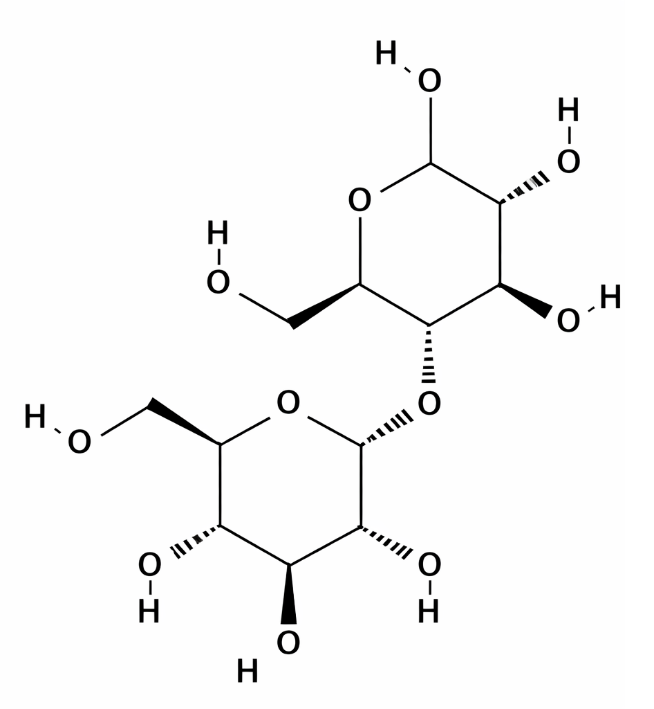
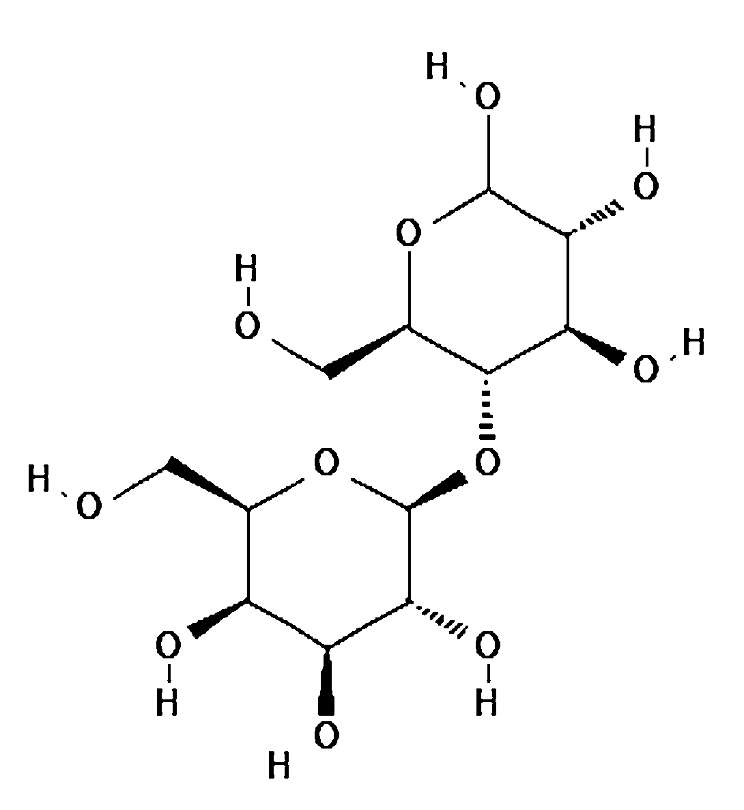

## Theory

Carbohydrates are one of the major classes of biomolecules, serving as primary sources of energy and structural components in living organisms. Chemically, they are polyhydroxy aldehydes or ketones, or compounds that yield such molecules upon hydrolysis. The general molecular formula of simple carbohydrates is Cn(H2O)n, reflecting their composition of carbon, hydrogen, and oxygen.

**Classification:**

1.  Monosaccharides - Simple sugars that cannot be hydrolyzed further (e.g., glucose, fructose).
2.  Disaccharides - Formed by condensation of two monosaccharides (e.g., sucrose, lactose, maltose).
3.  Polysaccharides - Complex carbohydrates composed of many monosaccharide units (e.g., starch, cellulose, glycogen).

**Reducing vs. Non-Reducing Sugars:**
- Reducing sugars possess a free aldehyde (-CHO) or ketone (-C=O) group capable of acting as a reducing agent. Examples: glucose, fructose, maltose, lactose.
- Non-reducing sugars lack a free reducing group, usually because it is involved in a glycosidic bond. Examples: sucrose, trehalose, raffinose.

Understanding the chemical distinction between these sugar types is essential before performing biochemical tests, as it determines their reactivity in qualitative and quantitative assays.

### Linkage in sugar molecules 

The linkage between sugar units is formed by glycosidic bonds, which can vary in type (&alpha; or &beta;) and position. The cleavage of these linkages is important in estimating the concentration of sugars in a sample.
&alpha;-Glycosidic Linkage: In an &alpha;-glycosidic linkage, the hydroxyl group on carbon 1 of one sugar is in the downward (&alpha;) position relative to the carbon chain. This type of linkage is common in disaccharides like maltose and sucrose. The linkage can be cleaved by enzymes (like amylase for starch) or under acidic conditions (acid hydrolysis) to yield simpler sugars.
&beta;-Glycosidic Linkage: In &beta;-glycosidic linkage, the hydroxyl group on carbon 1 of one sugar is in the upward (&beta;) position. This is seen in lactose and cellulose. &beta;-linkages are more resistant to acid hydrolysis, and often, enzymatic methods (such as lactase for lactose) are used to break them down.

&alpha;1 &#10230; 4 linkage Maltose linking two glucose molecules

&beta;1 &#10230; 4 linkage Lactose linking galactose and glucose

## Qualitative Analysis of Sugars

### Molisch Test
The Molisch test detects the presence of carbohydrates based on their dehydration to furfural derivatives by concentrated sulfuric acid, which react with α-naphthol to form a violet-colored complex.
**Chemical Reaction:**

Carbohydrate &xrarr; Furfural / Hydroxymethylfurfural (under Conc. H2SO4, Dehydration)

Furfural+ &alpha;-naphthol &xrarr; Violet (purple) condensation product

### Reducing Sugars

**(a) DNS (3,5-Dinitrosalicylic Acid) Method**

This method quantifies reducing sugars based on their ability to donate electrons under alkaline conditions, reducing yellow 3,5-dinitrosalicylic acid (DNS) to the orange-red 3-amino-5-nitrosalicylic acid.

**Chemical Reaction:**
Reducing Sugar (R-CHO) + DNS &xrarr; 3-amino-5-nitrosalicylic acid (orange-red) + Oxidized Sugar (R-COOH)

The absorbance of the colored product is measured at 540 nm, and its intensity is proportional to the concentration of reducing sugars.

**(b) Benedict's Test**
Benedict's reagent (containing CuSO4, sodium carbonate, and sodium citrate) detects reducing sugars via reduction of Cu2+ to Cu2O under alkaline conditions and heat.

**Chemical Reaction:**

R-CHO+2Cu2++5OH- &xrarr; R-COO- + Cu2O (brick-red)+3H2+O 

**Observation:**
Blue &xrarr; No reducing sugar
Green &xrarr; Trace amount
Yellow to Brick-red &xrarr; Increasing concentration of reducing sugars
 
### Non-Reducing Sugars

**Hydrolysis and DNS Method**
Non-reducing sugars such as sucrose are hydrolyzed by acid into their reducing monosaccharide components before applying the DNS method.
**Hydrolysis Reaction:**
C12H22O11+H2O &xrarr; C6H12O6(Glucose)+C6H12O6(Fructose) //(under H+ and heat)

After hydrolysis, the reducing ends of glucose and fructose can react with DNS reagent as in the reducing sugar assay.

## Applications of Methods
1. **DNS Method:** High sensitivity and commonly used in research labs for quantitative analysis.
2. **Benedict's Test:** Simple and semi-quantitative; suitable for teaching or rough estimation.
3. **Hydrolysis + DNS:** Enables total sugar estimation by accounting for non-reducing sugars.